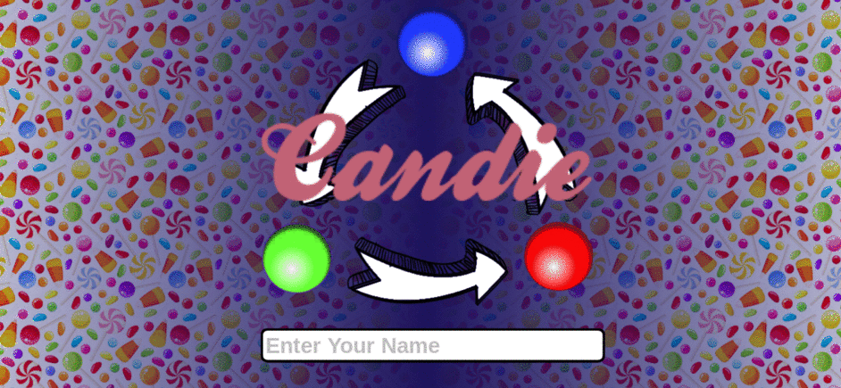
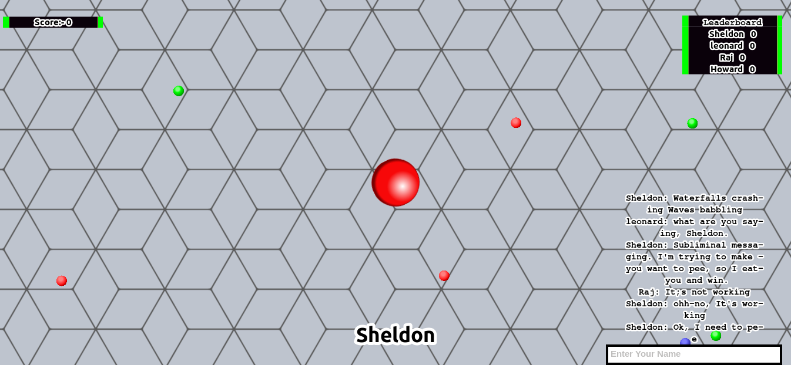

# Candie 
## User Documentaion

### Setup
   Welcome to **user documentation** for candie. This is a small walkthrough of all features of the game.Candie is meant to be an __opensourced, dedicated server based, multiplayer__ game. So, you need node to create a localserver.
.
   The Installation procedure is extremely simple, similar to one needed to get piece of code written in node to run, If you are familiar with node, you might as well skip this part.

* make sure you have node installed locally on your machine by testing with this command. make sure you install _node_ before proceeding

      npm --version

* Clone the repository first to a convienient folder. Change to  the cloned directory and Install the dependencies required using the command
    
      npm install --save

* In Order to deploy the node server, user the command
      
      node app.js

* Other players need to connect to your local server, so create a local wifi-hotspot on your desktop, and other players can connect to it using your ip. Say if your ip is **10.42.0.1**. Others can access it by opening up this in their browser, on port **4040**.

      http://10.42.0.1:4040

### the Home Screen

   Enter your name and press enter twice, nothing much here

### The HUD Elements

   
   Basic movement can be done using arrow keys. *beware* the movement speed is not same in all directions, this was initially regarded a bug and is rather easy to fix, but when it resulted in good chases and clever kills, we just let it be :P .

   Other HUD elements include scorebar to the top-left, leaderboard to the right-top and and a chatbox to the lower-right.

### How to play.
   
   Notice the small red, blue, green orbs floating around. That makes your player to change color. there is a constant number of orbs of each color which can be altered.

   The aim of the game is to eat as many players as possible, eating each player causes you to gain 10 points and being eaten causes you to return to the Home Screen. But the catch is that you can eat players of only one color at a time. As shown in the scematic below, Red eats blue, blue eats green and green eats red. 

   Although the game mechanic seems extremely simple, It's even simpler to forget which color can be eaten and that's where the fun begins. Enjoy !! :P